# s3s

[![Apache 2.0 licensed][license-badge]][license-url]
[![Unsafe Forbidden][unsafe-forbidden-badge]][unsafe-forbidden-url]

[license-badge]: https://img.shields.io/badge/license-Apache--2.0-blue.svg
[license-url]: ./LICENSE
[unsafe-forbidden-badge]: https://img.shields.io/badge/unsafe-forbidden-success.svg
[unsafe-forbidden-url]: https://github.com/rust-secure-code/safety-dance/

S3 Service Adapter

| crate                      |                                           version                                           |                                 docs                                 |
| :------------------------- | :-----------------------------------------------------------------------------------------: | :------------------------------------------------------------------: |
| [s3s](./crates/s3s/)       |        |        |
| [s3s-aws](./crates/s3s-aws/)       |        |        |
| [s3s-fs](./crates/s3s-fs/) |  |  |

This experimental project intends to offer an ergonomic adapter for building S3-compatible services.

`s3s` implements Amazon S3 REST API in the form of a generic [hyper](https://github.com/hyperium/hyper) service. S3-compatible services can focus on the S3 API itself and don't have to care about the HTTP layer.

`s3s-aws` provides useful types and integration with [`aws-sdk-s3`](https://crates.io/crates/aws-sdk-s3).

`s3s-fs` implements the S3 API based on file system, as a sample implementation. It is designed for integration testing, which can be used to [mock an S3 client](https://github.com/Nugine/s3s/blob/main/crates/s3s-fs/tests/it_aws.rs). It also provides a binary for debugging. [Play it!](./CONTRIBUTING.md#play-the-test-server)

## How it works

The diagram above shows how `s3s` works. 

`s3s` converts HTTP requests to operation inputs before calling the user-defined service. 

`s3s` converts operation outputs or errors to HTTP responses after calling the user-defined service.

The data types, serialization and deserialization are generated from the smithy model in [aws-sdk-rust](https://github.com/awslabs/aws-sdk-rust) repository. We apply manual hacks to fix some problems in [smithy server codegen](https://awslabs.github.io/smithy-rs/design/server/overview.html) and make `s3s` ready to use now.

## Contributing

+ [Development Guide](./CONTRIBUTING.md)
+ [Code of Conduct](./CODE_OF_CONDUCT.md)
